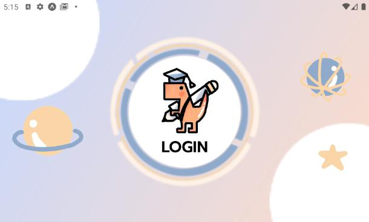

# T-Lec
React-Native Project in MOBILE DEVICE PROGRAMMING subject in KMITL :iphone: :telephone_receiver:

## Screenshots :camera_flash:

 

 

 

 

 

 

 

## Responsive Screenshots :camera_flash:

 

 

  
## Developer :computer:
||||
|:---:|:---:|:---:|
|[Fyefee](https://github.com/Fyefee)|[WSBoos](https://github.com/WSBoos)|[angellllegna](https://github.com/angellllegna)|
|Developer|UX/UI Designer   Ranking Screen Developer|Tester   Junior Developer|
