# T-Lec
React-Native Project in MOBILE DEVICE PROGRAMMING subject in KMITL :iphone: :telephone_receiver:

## Screenshots :camera_flash:

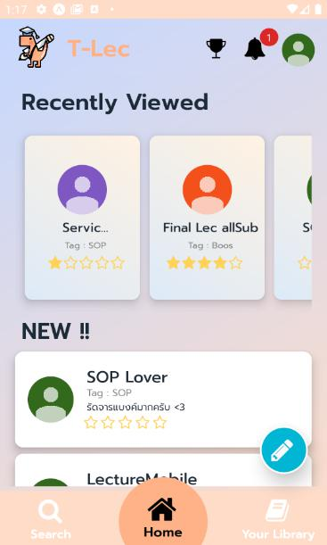 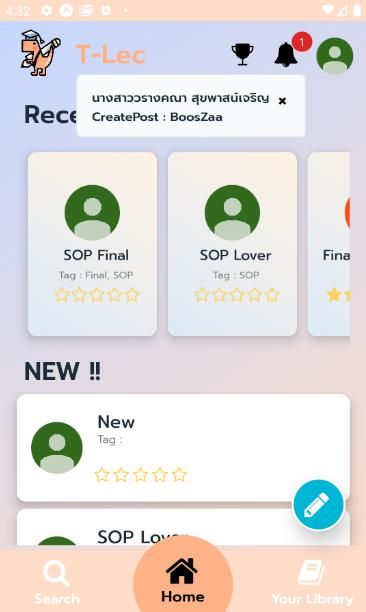

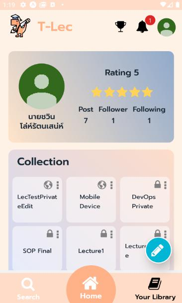 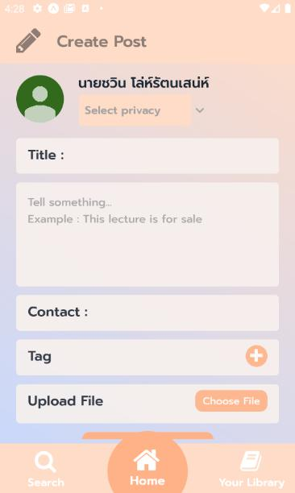

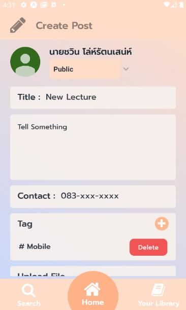 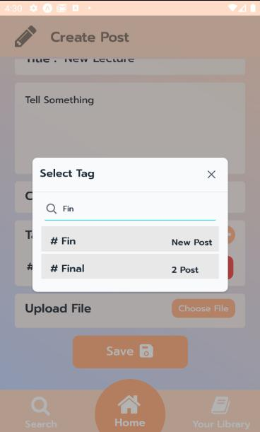

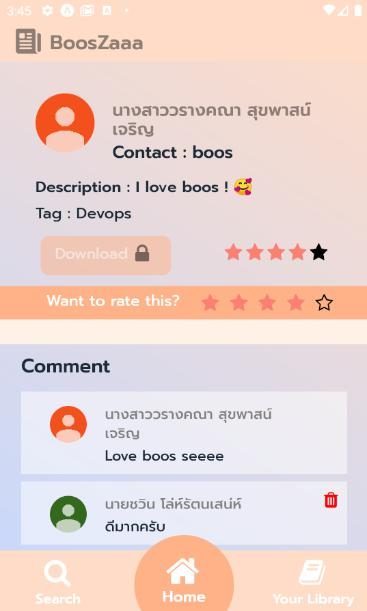 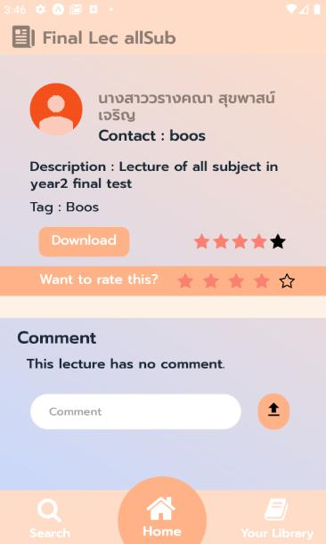

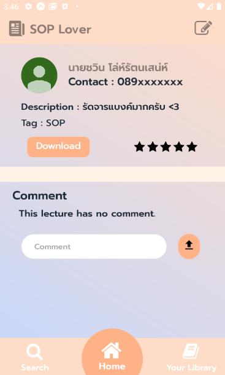 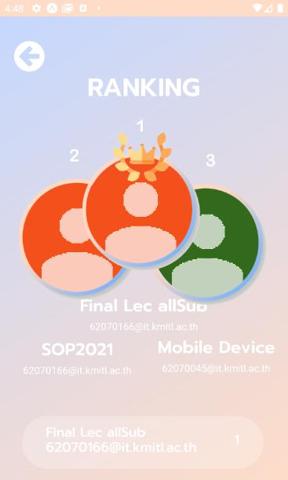

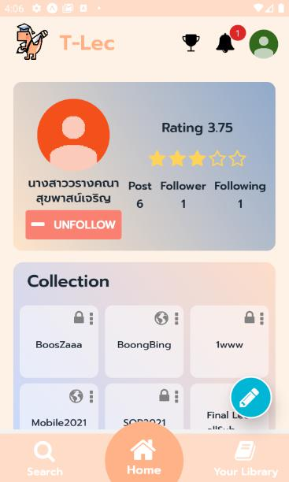 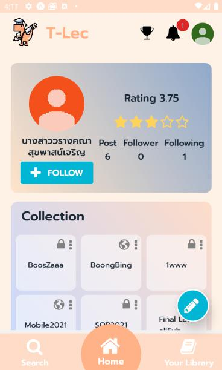

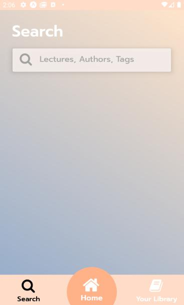 

## Responsive Screenshots :camera_flash:

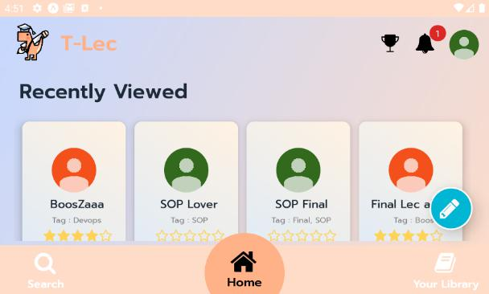 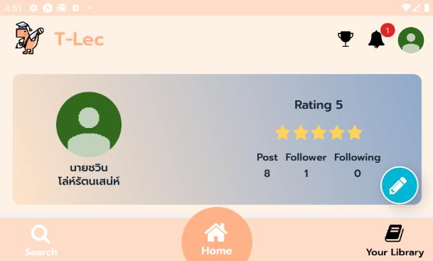
  
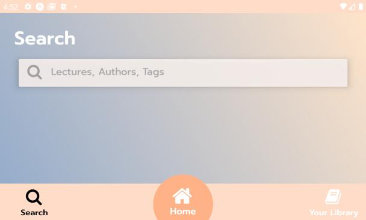

  
## Developer :computer:
||||
|:---:|:---:|:---:|
|[jeffy34931](https://github.com/Fyefee)|[jinnygym](https://github.com/jinnygym)|-|
|นายชวิน โล่ห์รัตนเสน่ห์ - 62070045 -|นางสาวศุภิสรา ชีวนันทพร - 61070230 -|นายธีรภัทร์ บุญช่วยแล้ว - 62070096 -|
